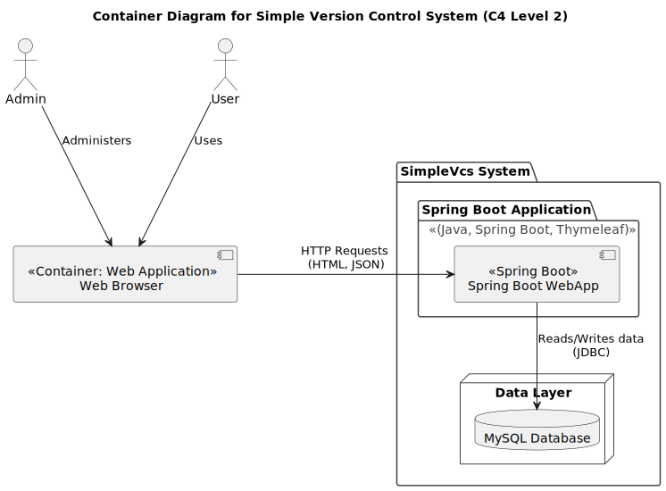
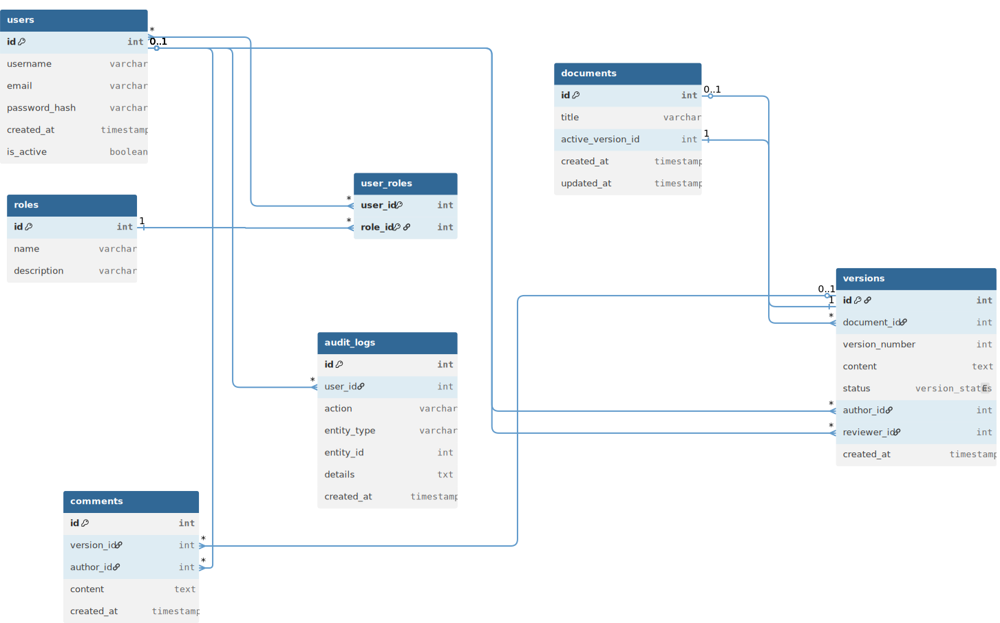

# Simple VCS (Version Control System)

A simplified, web-based Version Control System and Document Management application built with **Spring Boot** and **Thymeleaf**. This application provides a robust platform for managing document versions, collaborative commenting, and administrative user management with strict role-based access control.
## Key Features

- **Document Versioning & Management**: Upload, track, and manage document iterations. View document metadata, history, and active versions.
- **Collaborative Commenting**: Interactive, dynamic commenting system strictly governed by role-based access and document status (e.g., Draft, Pending Review, Active).
- **Admin Dashboard**: Comprehensive user management, allowing administrators to modify user roles, adjust statuses, and manage accounts through an intuitive UI.
- **Role-Based Access Control (RBAC)**: Secure access tailored to different user roles (Admin, Contributor, Reviewer, etc.) utilizing Spring Security.
- **Diff Checker**: Built-in functionality to compute and visualize differences between document versions using Java Diff Utils.
- **PDF Export**: Seamless conversion of HTML formats into PDF using OpenHTMLtoPDF and JSoup.
- **RESTful APIs & OpenAPI**: Fully documented API endpoints using Springdoc OpenAPI (Swagger).
## Technology Stack

- **Backend**: Java 21, Spring Boot 3.2.5, Spring MVC, Spring Data JPA, Spring Security
- **Frontend**: Thymeleaf, HTML5, CSS3, Vanilla JavaScript
- **Database**: MySQL 8+
- **Containerization**: Docker & Docker Compose
- **Tools**: Maven, Lombok, Java Diff Utils

## Prerequisites

Before you begin, ensure you have met the following requirements:
- **[Java Development Kit (JDK) 21](https://jdk.java.net/21/)** or higher installed.
- **[Maven](https://maven.apache.org/download.cgi)** installed (or use the provided `mvnw` wrapper).
- **[Docker Desktop](https://www.docker.com/products/docker-desktop/)** installed for spinning up the local database.
## Getting Started

### Local Environment Setup

This project uses Docker to quickly provision a local MySQL database.

1. **Clone the repository** (if you haven't already):
   ```bash
   git clone <your-repository-url>
   cd simple-vcs
   ```

2. **Start the Database**:
   Run the following command to start the MySQL database in the background:
   ```bash
   docker compose up -d
   ```
   *The database will now be running on `localhost:3306` with the username `root` and password `root`.*

3. **Build and Run the Application**:
   Use the Maven wrapper to build and run the Spring Boot application:
   ```bash
   ./mvnw spring-boot:run
   ```
   *For Windows, use `mvnw.cmd spring-boot:run`*

4. **Access the Application**:
   Open your browser and navigate to `http://localhost:8080`.

### Stopping the Database
To stop the MySQL database without losing data, run:
```bash
docker compose stop
```
If you wish to remove the database container entirely:
```bash
docker compose down
```
## API Documentation

The application exposes its API documentation through Swagger UI. Once the app is running locally, you can explore the endpoints at:
- **Swagger UI**: `http://localhost:8080/swagger-ui.html`
## Architecture Overview

The system embraces a **Server-Side Rendered (SSR) Thymeleaf MVC** architecture:
- **Presentation Layer**: Dynamic Thymeleaf templates infused with generic web forms and vanilla JavaScript for interactive UI elements (like document details and dynamic commenting).
- **Business Layer**: Spring Services handling complex business logic for version control, commenting authorization, and access management.
- **Data Layer**: Spring Data JPA repositories interfacing with a containerized MySQL instance.


Here is our C4 Container Level 2 architecture diagram visualizing the system:



### Database Schema
The underlying data model for the Simple VCS showing the relationships between Users, Documents, Versions, Roles, Audit-logs and Comments.




## License

This project is licensed under the GPL-3.0 license - see the [LICENSE](LICENSE) file for details.